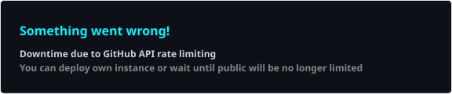

<!-- BANNER -->

<p align="center">
  
</p>

<p align="center">
  
</p>

<p align="center">
  
  
  
</p>

<p align="center">
  <a href="https://linkedin.com/in/YOUR-LINKEDIN-HANDLE">
    
  </a>
  <a href="https://facebook.com/YOUR-FACEBOOK-HANDLE">
    
  </a>
  <a href="mailto:your-real-email@gmail.com">
    
  </a>
</p>

---

### 🧑‍💻 About Me

```javascript
const dave = {
  name:      "Dave B. Lausa",
  course:    "BSCS",
  username:  "@Dave640-creator",
  location:  "Philippines",
  role:      "Developer (Mobile / Web Application, Website)",
  
  currentlyLearning: ["AI & Machine Learning 🤖", "Software Development"],
  funFact:   "I debug with console.log and I'm not ashamed 😂",
};
```

---

### 🔥 GitHub Streak

<p align="center">
  
</p>

---

### 📊 GitHub Stats

<p align="center">
  
  
</p>

---

### 🛠️ Tech Stack

<p align="center">
  
</p>

<p align="center">
  
</p>

---

### 🏆 GitHub Trophies

<p align="center">
  
</p>

---

### 🐍 Contribution Snake

<p align="center">
  
</p>

---

### 📈 Activity Graph

<p align="center">
  
</p>

---

<p align="center">
  
</p>

<p align="center">
  <i>⭐ From <a href="https://github.com/Dave640-creator">Dave640-creator</a> — thanks for stopping by!</i>
</p>
